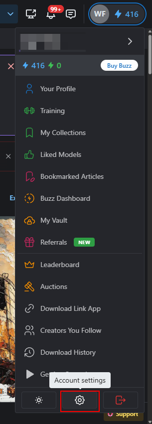
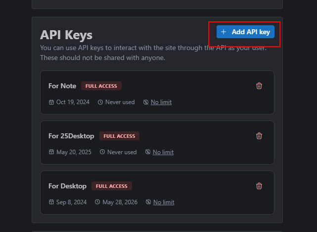
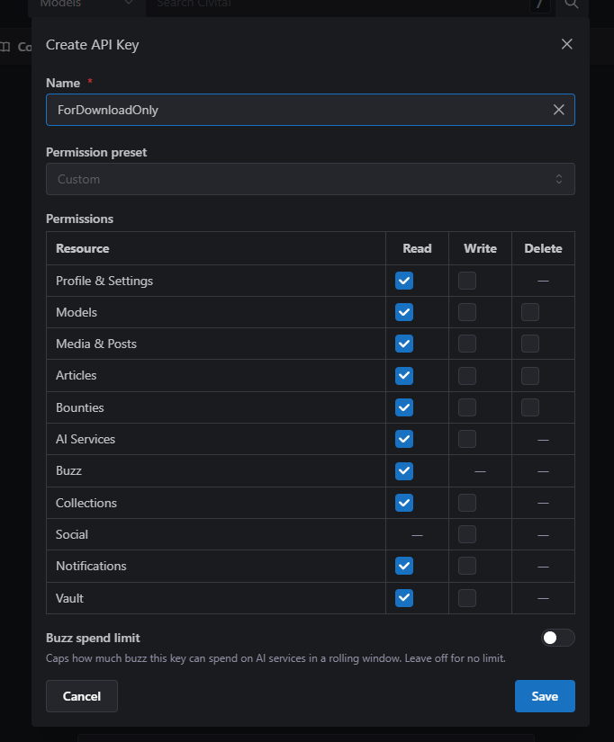
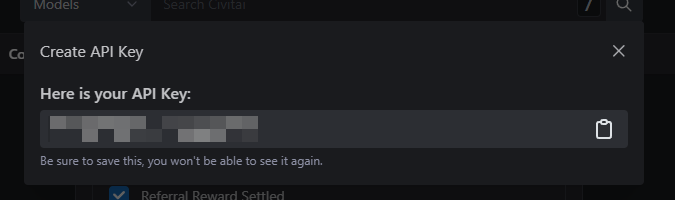
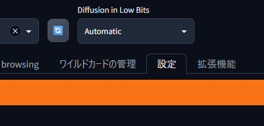
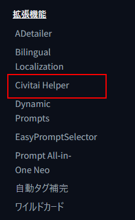
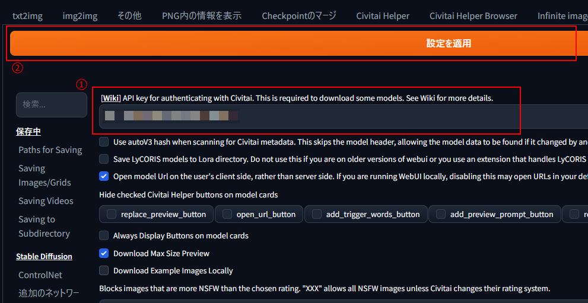
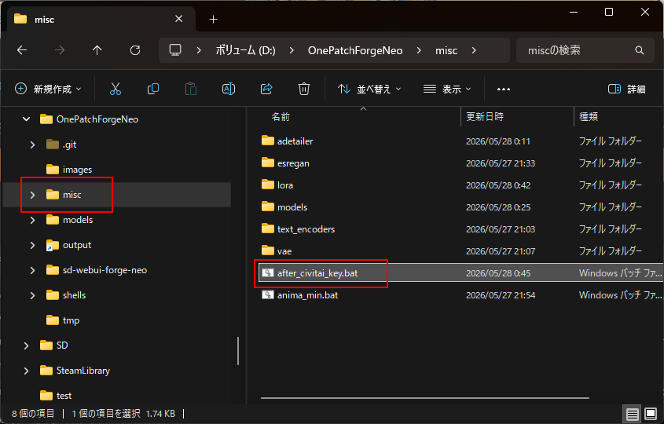

# OneBatchForgeNeo

ForgeNeo をワンパン操作でインストールできるパッチを目指すリポジトリ。

## インストール方法

- [こちらのファイル](https://github.com/Sunao-Yoshii/OnePatchForgeNeo/raw/main/shells/ProjectInstall.bat) を右クリックから保存します。
  - NVIDIA GPU の Windows PC、20GB 以上の空きストレージ、PC の管理者権限、アバストなどの Windows Diffender でないウィルスチェック無効化、VPN の無効化が必要です。
- `C:/ForgeNeo/` 等の浅いパスの空のフォルダで `ProjectInstall.bat` をダブルクリック実行します。
  - `WindowsによってPCが保護されました` と表示されたら、`詳細表示` から `実行` します。
- インストールが終わったら、`ForgeNeo.bat` を実行します。
  - VRAM が 16GB 以上ある場合、`ForgeNeo-highSpeed.bat` を実行できる可能性があります。こちらは最適化オプション入りなので実行速度が若干早くなる可能性があります。
- 追加で CivitaiKey を設定することで、追加のモデルが利用可能になります。

## トラブルシューティング

- `ForgeNeo.bat` 起動させようとしたらエラったんだけど？  
  とりあえず `ResetEnv.bat` を実行して再度試してみて。たまに初回起動時に、Python のリポジトリ死んでて動かない場合もある…その場合は 2-3 時間置いてリトライすると通ったりするよ。
- アップデートしたいんだけど？  
  `UpdateForgeNeo.bat` 叩いてくれい。ついでにこのリポジトリも更新されるので、`misc` あたりに追加の便利な LoRA とか追加されてるかも？

## 起動/終了方法

- `ForgeNeo.bat` をダブルクリックで起動（黒いコンソール画面が出てきます）
- コンソール画面を閉じれば終了です。

## 追加モデルのインストール方法

1. まずは Civitai にログインして設定を開きます。  
    
2. 設定を開いたら「APIKeys」までスクロールして、「Add API key」をクリック。  
   
3. キー設定はダウンロードのみにしておきます。
   
4. 保存すると API キーが現れます(モザイクかかってる部分です)。
   
5. そしたら ForgeNeo を起動して「設定」を開きます。
   
6. スクロールしていくと、「拡張機能」に「Civitai Helper」が表示されます。
   
7. 「API key for...」の項目(一番上)に、上の 4 で出てきたキーを貼り付けて、「設定を適用」します。
   
8. 最後にワンパンディレクトリの「misc」の中にある「after_civitai_key.bat」を実行すると、追加のモデルや Turbo Lora がインストールされます。
   

## 構成

ForgeNeo 環境をインストールするにあたり、複雑な手順をすべて自動化するリポジトリです。  
ディレクトリ構成は次の通りです。

- misc : 追加プラグインなどをインストールするためのフォルダ
- models : ForgeNeo で利用する各種モデル、スクリプト
- shells : 各種自動化を行うにあたり利用する　Bat/PowerShell 置き場

